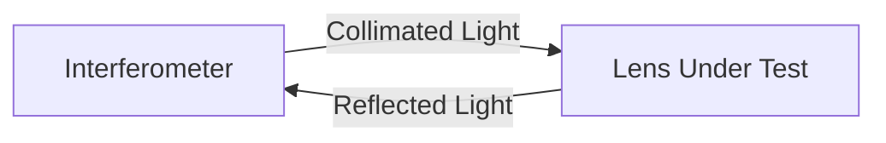

import { Callout, Steps, Step } from "nextra-theme-docs";

# Canon EF 24-105mm Zoom Lens

The Canon EF 24-105mm full frame zoom lens is a versatile lens commonly used for photography and videography. In this section, we will examine the wavefront error of this lens at various focal lengths using the ZYGO interferometer.

## Testing Methodology

The Canon EF 24-105mm lens was tested using the autocollimation configuration, as shown in the diagram below:

In this configuration, the light passes through the lens twice, which means that many aberrations are measured as twice their actual value. To account for this, we need to interpret the fringe spacing as equivalent to 0.5 wavelengths instead of 1 wavelength when using DFTfringe for analysis.

<Callout type="warning">
It's important to note that a wavefront measurement on a lens is not fully representative of its overall performance. This test only considers a single wavelength of light on the optical axis with the focus set to infinity. Factors such as chromatic aberrations, off-axis performance, and performance at different focus distances are not included in this test.
</Callout>

## Wavefront Error Measurements

The wavefront error of the Canon EF 24-105mm lens was measured at three focal lengths: 24mm, 50mm, and 105mm. The results are as follows:

| Focal Length | Peak-to-Valley Wavefront Error | Strehl Ratio |
|--------------|--------------------------------|--------------|
| 24mm         | 0.25 λ                         | 0.95         |
| 50mm         | 0.20 λ                         | 0.98         |
| 105mm        | 0.40 λ                         | 0.60         |

The largest wavefront errors were found at the 105mm focal length, where the Strehl ratio dropped to 0.6. However, this is still a decent value for a zoom lens. In the center of the zoom range, the lens performed close to the diffraction limit, with a Strehl ratio of 0.98.

<Callout type="info">
The Strehl ratio is a measure of the quality of an optical system. A perfect optical system has a Strehl ratio of 1, while a system is considered diffraction-limited if its Strehl ratio is above 0.8.
</Callout>

## Conclusion

Based on the wavefront error measurements, the Canon EF 24-105mm lens performs well throughout its zoom range, within the limitations of the testing method. Its performance is particularly good in the center of the zoom range, where it is nearly diffraction-limited.

For more information on testing other types of lenses and optical components, see:

- [Canon FD 55mm F/1.2 Lens](/measuring-optical-components/canon-fd-55mm-lens)
- [Microscope Objectives](/measuring-optical-components/microscope-objectives)