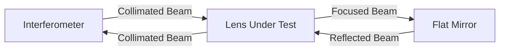

import { Callout, Steps, Step } from "nextra-theme-docs";

# Canon FD 55mm F/1.2 Lens

Next on the list of items to test is the Canon FD 55mm F/1.2 lens. This is a rather famous vintage lens known for being the first consumer lens containing an aspherical element. With its F/1.2 aperture, it's very light sensitive and well-suited for indoor photography without using a flash.

<Callout>
The earliest versions of this lens, introduced in 1971, contained radioactive Thorium Oxide. However, this particular lens, purchased in March 1980, does not contain Thorium and therefore does not display the characteristic radiation browning observed in radioactive lenses.
</Callout>

For testing the wavefront deformation in this lens, we utilize a configuration called autocollimation, which is schematically depicted here:

Because the light passes through the lens twice in this test, many aberrations are measured to be twice as large as they would be with a single pass. So when this configuration is used, it requires us to interpret the fringe spacing as equivalent to only 0.5 wavelength instead of 1 wavelength.

<Callout type="warning">
Doing a wavefront measurement on a lens is not representative of overall lens performance. This test only considers one particular wavelength of light on the optical axis with the focus setting to infinity. Factors like chromatic aberrations, off-axis performance in the image field, and performance at proximity are not included.
</Callout>

Here is the wavefront error of the lens at its full aperture:

As you can see, the wavefront error is quite large. The total P-V wavefront error is more than $3\lambda$, and the most apparent errors are spherical aberration and some astigmatisms. The Strehl ratio is quite disappointing as well. As a consequence, this lens can never provide high sharpness images at the maximum aperture.

Now, it's interesting to see what happens if we limit the aperture of this lens to F/4.0. By doing that, we will lose a lot of light (about 90%), but this also limits the wavefront error to the one present in the central part of the aperture.

Here is the wavefront analysis at F/4:

Reducing the aperture to F/4 eliminates almost all of the spherical error and the astigmatism present in the wavefront at full aperture, allowing the lens to perform at the diffraction limit.

Here is a comparison of the text on a permanent marker shot with F/1.2 and F/4 on an APS-C sensor:

It's clear that the $3\lambda$ wavefront error is influencing the sharpness and contrast pretty badly. To use this lens effectively, it's best to always set it to a smaller aperture whenever there is sufficient light available; otherwise, you'll end up with very soft images.

For a more holistic evaluation of lens performance, consider using the methods described in the [Measuring Optical Components](/measuring-optical-components) section.