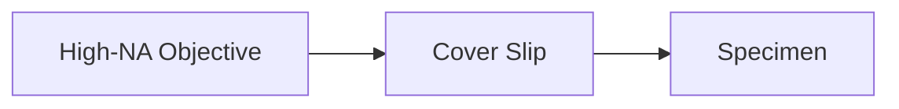

import { Callout, Steps, Step } from "nextra-theme-docs";

# Cover Slip Thickness

When using high numerical aperture (NA) microscope objectives, the thickness of the cover slip plays a crucial role in achieving optimal performance. Cover slips are thin glass plates placed between the specimen and the objective lens to protect the lens and provide a uniform surface for focusing.

## The Impact of Cover Slip Thickness on High-NA Objectives

High-NA objectives are designed to capture a wide range of angles from the specimen, allowing for higher resolution and better light gathering. However, this also makes them more sensitive to aberrations introduced by the cover slip.

<Callout type="info">
The standard cover slip thickness for most microscope objectives is 0.17 mm. Objectives with a correction collar allow for adjusting to different cover slip thicknesses.
</Callout>

As light passes through the cover slip, it experiences refraction, which can cause spherical aberration. The amount of spherical aberration introduced depends on the NA of the objective and the thickness of the cover slip.

The relationship between the maximum resolvable spatial frequency $k_{max}$ and the NA is given by:

$k_{max} = \frac{2\pi}{\lambda} \cdot NA$

where $\lambda$ is the wavelength of light.

## Compensating for Cover Slip Thickness

To achieve the best performance from a high-NA objective, it is essential to use the cover slip thickness specified by the manufacturer. Some objectives, such as the Leica Fluotar 20x/0.5, have the optimal cover slip thickness engraved on the barrel.

<Steps>
### Step 1

Check the objective for the specified cover slip thickness. If not mentioned, refer to the manufacturer's documentation.

### Step 2

Use cover slips with the specified thickness for optimal performance. Deviating from the recommended thickness may result in reduced resolution and contrast.
</Steps>

If the objective has a correction collar, follow these steps to adjust for the cover slip thickness:

<Steps>
### Step 1

Place a sample with the desired cover slip thickness on the microscope stage.

### Step 2

Focus on the specimen using the objective.

### Step 3

Adjust the correction collar until the image appears sharp and free of aberrations.
</Steps>

By using the correct cover slip thickness and properly adjusting the correction collar (if available), you can minimize spherical aberration and achieve the best possible performance from your high-NA objectives.

For more information on measuring the wavefront error of microscope objectives, see the [Microscope Objectives](/measuring-optical-components/microscope-objectives) section.