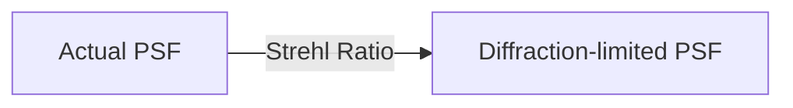

import { Callout, Steps, Step } from "nextra-theme-docs";

# Interferogram Analysis with DFTfringe

DFTfringe is a powerful, free software designed for analyzing interferograms and calculating wavefront data. It was originally developed with amateur telescope making in mind but has a wide range of applications in optical testing and metrology.

In this section, we'll walk through the process of using DFTfringe to evaluate interferograms captured with the upgraded ZYGO GPI LC interferometer. By the end, you'll understand how to extract detailed wavefront information from your interferograms.

## Getting Started

Before we begin, make sure you have the following:

1. DFTfringe software installed on your computer (available for free download)
2. High-resolution interferograms captured with the [upgraded ZYGO GPI LC interferometer](/zygo-gpi-lc-interferometer/upgrading-with-modern-camera)

<Callout type="info">
Tip: Capture multiple interferograms with slightly different fringe angles and spacings for more accurate wavefront analysis.
</Callout>

## Configuring DFTfringe

When you first launch DFTfringe, you'll need to input some settings to ensure accurate wavefront calculations:

<Steps>

### Step 1

Set the wavelength of the light source used in your interferometer (e.g., 632.8 nm for a HeNe laser).

### Step 2

Define the fringe spacing in the interferogram. This value represents the phase shift per fringe:

- For most configurations, each fringe represents 1 wavelength ($\lambda$) of phase shift.
- In autocollimation setups, set this value to 0.5 wavelengths ($\lambda/2$).

</Steps>

## Analyzing Interferograms

With DFTfringe configured, you're ready to start analyzing your interferograms:

<Steps>

### Step 1

Import a recorded interferogram into DFTfringe.

### Step 2

Define the areas you wish to include or exclude in the wavefront evaluation. This allows you to focus on specific regions of interest.

### Step 3

Perform a 2D Fourier transform on the selected area. DFTfringe will display the resulting frequency spectrum.

### Step 4

Apply low-frequency spatial filtering to remove unwanted frequencies (e.g., global intensity variations due to uneven illumination).

### Step 5

Resample the filtered image to a specific size. DFTfringe will then calculate the wavefront data from this resampled image.

</Steps>

## Interpreting Results

DFTfringe fits the calculated wavefront data to a set of known aberrations (e.g., tilt, spherical aberration, astigmatism). You can choose to include or exclude specific aberrations from your analysis.

<Callout type="info">
Tip: Tilt is generally not an aberration of interest, as it describes the orientation between the reference and the wavefront under test. Consider excluding it from your analysis.
</Callout>

The software also presents the Strehl ratio, a useful parameter for specifying wavefront performance close to the diffraction limit. The Strehl ratio is the ratio between the actual peak intensity of the point spread function (PSF) and the theoretical maximum intensity of a diffraction-limited PSF:

A Strehl ratio above 0.8 is often considered "diffraction-limited" performance.

## Averaging Wavefront Data

For more accurate results, you can average wavefront data from multiple interferograms:

1. Analyze several interferograms using the steps outlined above.
2. Use DFTfringe's built-in averaging function to combine the wavefront data from each interferogram.

This averaging process helps to reduce noise and random errors, providing a more precise representation of the wavefront.

## Conclusion

DFTfringe is a versatile tool for analyzing interferograms and calculating wavefront data. By following the steps outlined in this section, you can extract detailed information about the optical performance of your system using the [upgraded ZYGO GPI LC interferometer](/zygo-gpi-lc-interferometer/upgrading-with-modern-camera).

With practice, you'll be able to quickly identify and quantify aberrations, assess diffraction-limited performance, and make informed decisions about your optical designs.